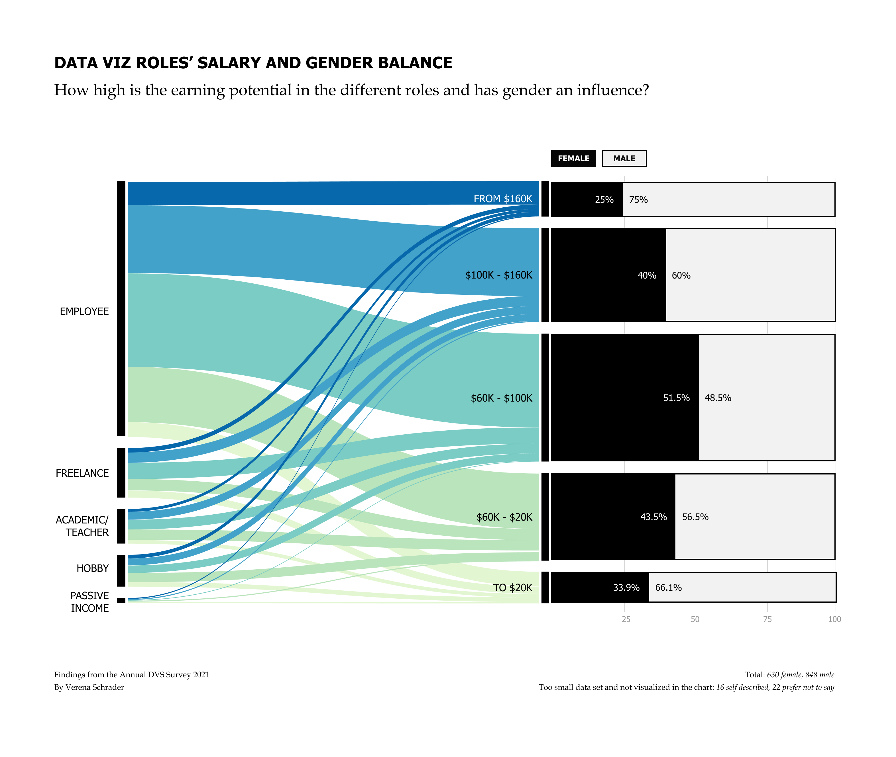

#  Data Visualization Survey Challenge 2021 
#### Data Viz Roles' Salary and Gender Balance

_Findings from the Annual DVS Survey 2021
by Verena Schrader_

When considering becoming a data visualization designer or switching roles within field, a question that comes into one's mind is how high is the earning potential. This question was the starting point for analyzing the data. Another goal was to evaluate gender balance.

The DVS Survey 2021 data has been used to create the visualization. The first part, the flowing sankey diagram, shows that salaries vary greatly, based on the different roles. The second half shows the percentage of women and men in the respective salary ranges. The amount of diverse data was too small to be shown in the diagram. 

The result shows that the salary depends not only on the working field and role, but also on gender. The visualization illustrates that the balance is not yet finished. Although gender equality has made great steps forward in the past few years, one can see that there is still room for improvement. 

The fonts and colors used in the diagram are accessibility tested and should also work for people having any kind of color blindness. Furthermore salary information from the survey results were summarized to ranges to make the chart easier to understand. 

_Based on Annual Data Visualization State of the Industry (SOTI) Survey_

Survey data: https://www.datavisualizationsociety.org/soti-challenge-2021
